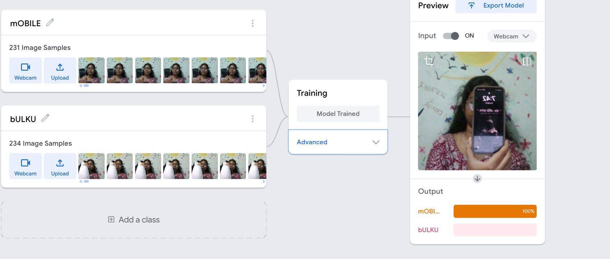
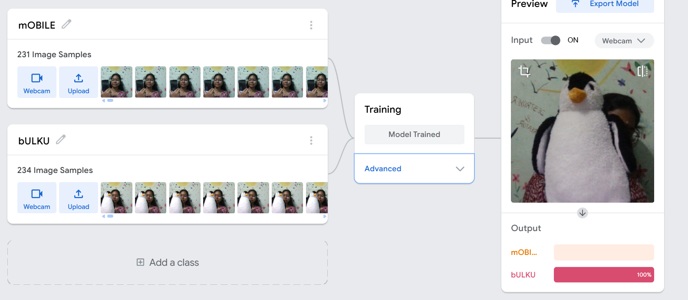

# Image Classification with Teachable Machine

## 📌 Project Overview
Built an image classification model using Google's Teachable Machine to distinguish between two classes: **mOBILE** and **bULKU**.

## 🛠️ Tools Used
- Google Teachable Machine
- TensorFlow / Keras
- Python
- Webcam input

## 📊 Model Details
- **mOBILE:** 231 image samples
- **bULKU:** 234 image samples
- **Training:** Model trained successfully
- **Accuracy:** 100% confidence on test samples

## 🎯 How It Works
The model uses webcam input to classify images in real-time. It outputs the predicted class with a confidence score.
## 📸 Screenshots

## 🚀 How to Run
1. Clone this repository
2. Open the model in Google Teachable Machine (or run the exported Python script)
3. Enable your webcam
4. Show an object to the camera
   
## 🔗 Connect
- LinkedIn: [linkedin.com/in/yamuna-rajamani-a69b333](https://linkedin.com/in/yamuna-rajamani-a69b333)
- Email: yamunarajamani4@gmail.com
